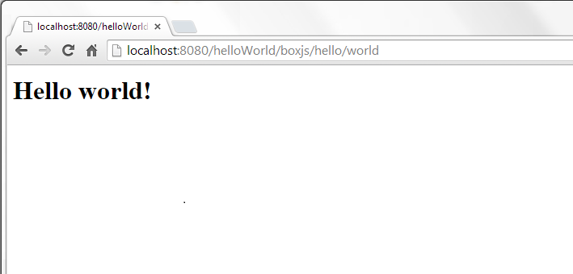
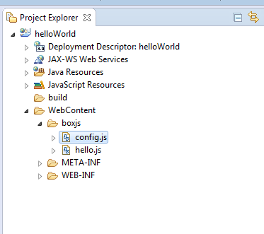
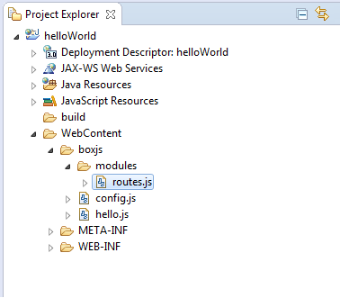
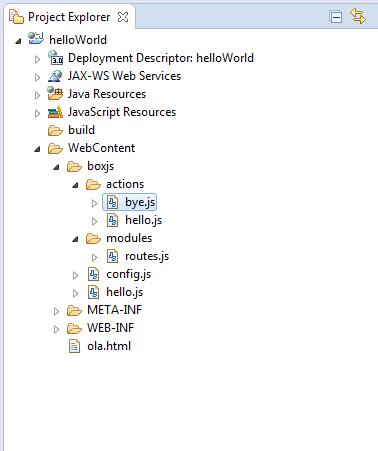
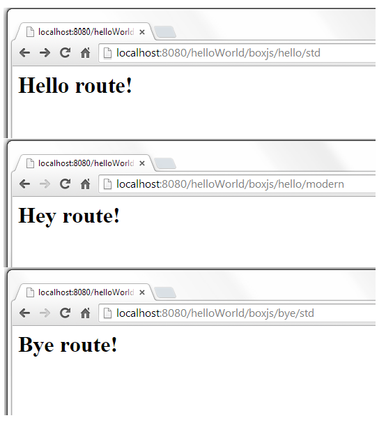
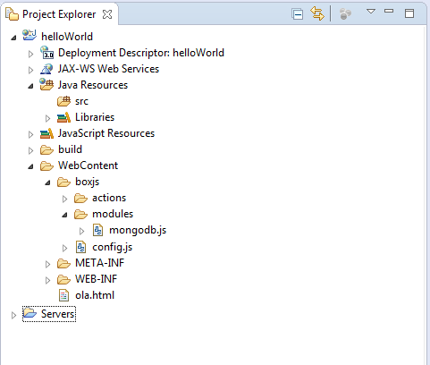

# boxJS

O boxJS é um container de execução JavaScript para servidores Web, 
ou seja, é uma plataforma Server-Side JavaScript(SSJS).

## Primeiros Passos

Depois de [configurar o seu ambiente para o funcionamento do boxJS](https://github.com/cneryjr/boxjs/tree/master/configurar-ambiente), já podemos criar 
nosso primeiro arquivo javascript que será executado pelo servidor. Podemos chamá-lo de 'hello.js' e escreveremos apenas o seguinte código nele:

~~~ javascript

exports = {
	world: function (params,request,response) {
		response.write("<html><body> <h1>Hello world!</h1> </body></html>");
	}
}

~~~

Agora, já podemos acessar nossa primeira página fornecida via boxJS através da seguinte URL `localhost:8080/<nome_do_projeto>/boxjs/hello/world`.

## Precisando de Ajuda?

Envie-nos um [e-mail](mailto:suporteboxjs@softbox.com.br)

Faça perguntas no Stackoverflow usando a [tag boxJS](http://pt.stackoverflow.com/questions/tagged/boxjs)

Construa sua primeira aplicação usando o boxJS com [nosso tutorial](https://github.com/cneryjr/boxjs/tree/master/tutorial)

## Vantagens

* SSJS baseado em threads
* Performático
* Fácil aprendizado
* Simples de usar
* Bom conjunto de APIs para utilização imediata
* 'Handler' único que trata todas as requisições vindas do cliente web (browser)

## Sumário

* [Configurando o `config.js`](#configurando-o-configjs)
* [Configurando rotas](#configurando-rotas)
* [Utilizando o `security.js`](#utilizando-o-securityjs)
* [MongoDB](#mongodb)
  * [Preparando para usar o MongoDB](#preparando-para-usar-o-mongodb)
  * [Usando o MongoDB](#usando-o-mongodb)

## Configurando o `config.js`

Voce pode ter reparado que o servidor encontrou alguns erros ao subir nosso primeiro projeto, isso aconteceu pois
toda vez que o boxJS é instanciado ele procura pelo arquivo `config.js` dentro da pasta `boxjs`, este arquivo
contém configurações a serem executadas assim que o box é instanciado.

Um exemplo do que é possível fazer com essas configurações é a inclusão de módulos, que devem seguir o seguinte
padrão.

~~~ javascript

var config = {
	modules: ["routes", "mongodb", "io", "binary", "jsrender","init"]
};

~~~

Para alguns módulos, como por exemplo o mongodb, é necessário que se inclua mais algumas configurações. No caso
do mongo, é necessário citar o link com o banco, o que deve deixar nosso `config.js` da seguinte forma:

~~~ javascript

var config = {
	modules: ["routes", "mongodb", "io", "binary", "jsrender","init"],
	
	mongodb: {
		datasource: "java:comp/env/mongo/MongoDSFactory"
	}	
};

~~~

OBS: Além disso, para utilizarmos o mongo é necessário criar o datasource no context.xml, isso pode ser feito 
adicionando a seguite tag (com suas devidas alterações) ao context.xml do Tomcat que rodará seu projeto.

~~~ xml
<Resource name="mongo/MongoDSFactory" auth="Container"
type="com.mongodb.MongoClient" factory="softbox.boxjs.MongoDSFactory"
singleton="false" user="" pass="" uri="mongodb://localhost:27017/nome_do_banco"/>

~~~

## Configurando rotas

Além das páginas html que estão na pasta `WebContent` que são fornecidas normalmente pelo Tomcat, já sabemos que é possivel
fornecer páginas através de comandos Javascript desde que os arquivos com estes comandos estejam dentro da pasta `boxjs`. 
Outra possibilidade que o boxJS traz é o uso de rotas, essas rotas podem ser definidas no arquivo `config.js`, do qual [já 
falamos anteriormente](#configurando-o-configjs), ou em um outro arquivo qualquer, desde que este seja adicionado como 
módulo no `config.js`. Consideramos o segundo modo o mais correto e é ele que pode ser encontrado no exemplo abaixo:

Primeiro devemos criar nosso arquivo `config.js`, nele incluiremos apenas o nosso módulo `routes`:

~~~ javascript

var config = {
	modules: ["routes"]
};

~~~

Agora podemos criar o arquivo `routes.js` que irá conter nossas rotas:

~~~ javascript

Router.add( 'hello', 'actions/hello');

Router.add( 'bye', 'actions/bye');

~~~

Os argumentos da função add, usada acima, são, respectivamente, o Url pattern daquela rota e o arquivo JS que responderá às requisições que
chegarem nela (o caminho deste arquivo é apartir da pasta `boxjs`).

No arquivo JavaScript dado como segundo argumento deve ser definido um objeto `exports` que terá como propriedade o que será suportado
no restante da URL, cada uma dessas propriedades é na verdade uma função que lida com a requisição do usuário.

Para o nosso exemplo, criamos o `hello.js` com o seguinte código:

~~~ javascript

exports = {
	modern: function (params,request,response) {
		response.write("<html><body> <h1>Hey route!</h1> </body></html>");
	},
	std: function (params,request,response) {
		response.write("<html><body> <h1>Hello route!</h1> </body></html>");
	}
}

~~~

E o `bye.js` com:

~~~ javascript

exports = {
	std: function (params,request,response) {
		response.write("<html><body> <h1>Bye route!</h1> </body></html>");
	}
}

~~~

Agora podemos acessar cada um desses métodos, respectivamente, com as seguintes URL:

## Utilizando o `security.js`

Caso algum módulo com o nome de `security` seja adicionado ao `config.js`, o boxJS garante que todas as requisições, passem, 
primeiramente, por este módulo, isso possibilita que seja criado algum tipo de restrição de acesso, onde uma certa página só será 
fornecida pelo servidor caso as restrições impostas pelo módulo `security` sejam atingidas.

Por padrão o arquivo security vem conforme [descrito aqui](https://github.com/cneryjr/boxjs/blob/master/boxjs/modules/security.js), ou seja, autorizando todo e qualquer acesso, porém 
tornar alguma página inacessível é uma tarefa simples.

Podemos tornar a página `localhost:8080/helloWorld/boxjs/hello/modern` inacessível fazendo as seguintes alterações ao `security.js` padrão:

~~~ javascript

safe.hasPermissionInThisMethod = function (paramsObject, request, response, methodName) {

	if(methodName=="modern") {
		http.response.setStatus(403);
		return false;
	}
	
    return true;
};

~~~

Lembramos que o `security.js` que vai junto com o boxJS é apenas um esboço de um módulo de segurança, quem o utiliza tem liberdade para 
(e deve) alterar o seu funcionamento.

OBS: Para pegar um header de uma requisição, basta usar o seguinte método `http.requestJava.getHeader("nome-do-header")`.

## MongoDB

### Preparando para usar o MongoDB

Como citado na parte de [como usar o `config.js`](#configurando-o-configjs), para usarmos o mongoDB o primeiro passo é adicioná-lo aos
módulos no `config.js` e citar o link com o banco:

~~~ javascript

var config = {
	modules: ["mongodb"],

	mongodb: {
		datasource: "java:comp/env/mongo/MongoDSFactory"
	}
};

~~~

Após modificar o `config.js` para ter estas configurações, devemos adicionar o datasource ao nosso servidor, isso pode ser feito adicionando
a seguinte tag ao context.xml:

~~~ xml

<Resource name="mongo/MongoDSFactory" auth="Container"
type="com.mongodb.MongoClient" factory="softbox.boxjs.MongoDSFactory"
singleton="false" user="" pass="" uri="mongodb://localhost:27017/nome_do_banco"/>

~~~

Agora adicione [o módulo do mongo](https://raw.githubusercontent.com/cneryjr/boxjs/master/boxjs/modules/mongodb.js) a sua pasta `modules`.

Finalmente, adicione o [jar do driver de conexão ao mongo](https://github.com/cneryjr/boxjs/blob/master/lib/mongo-java-driver-2.12.3.jar?raw=true) à pasta `lib` do `WEB-INF` e tudo deve funcionar normalmente.

### Usando o MongoDB

Para usar o MongoDB recomendamos a criação de um módulo `init.js`, com apenas o seguinte código:

~~~ javascript

db = db || {};

db.nome_do_banco = function() {
	return db.MongoDB.getDB("nome_do_banco");
}

~~~

Esse módulo init deve ser adicionado ao `config.js` e é importante para garantir que não serão criadas múltiplas conexões com o banco, com este passo pronto, basta que,
quando for necessário acessar uma collection, seja utilizado um código semelhante a:

~~~ javascript

var collection = db.nome_do_banco().getCollection("nome_da_collection");

~~~

Com uma collection em mãos uma variedade de operações pode ser utilizada:

* insert(doc) - insere um documento a uma collection
* find(query,fields) - executa a 'query' na collection retornando apenas os campos determinados em 'fields'
* count(query) - conta quantos documentos são compatíveis com 'query', sem carregá-los
* distinct(field, query) - retorna os valores que um determinado campo, 'field', assume, caso haja uma 'query', só retorna os valores distintos para esta 'query'
* remove(query) - remove as emtradas que são compatíveis com 'query'
* update(query,update,options) - atualiza as entradas que são compatíveis com 'query' para o valor 'update', sendo possível utilizar duas configurações opcionais:
  * upsert - caso nenhuma entrada seja compatível com 'query', invés de atualizar, insere uma nova entrada
  * multi - atualiza todas as entradas compatíveis com 'query'
* aggregate - http://docs.mongodb.org/manual/aggregation/

Mais detalhes podem ser vistos no próprio código comentado do módulo do mongo que você adicionou a sua pasta `modules`.