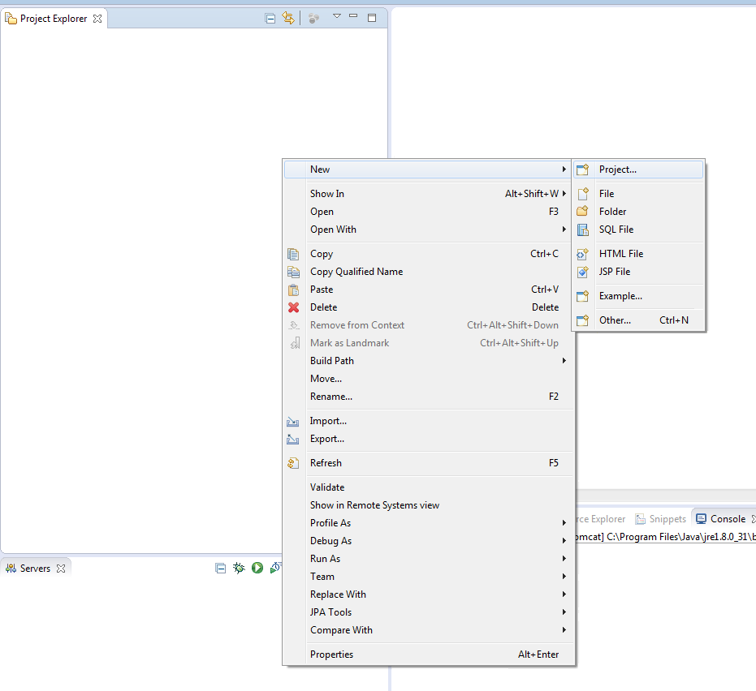
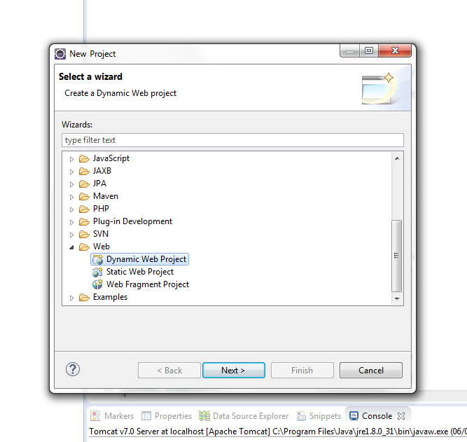
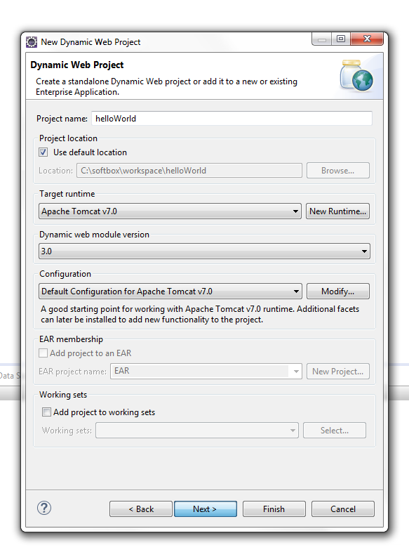
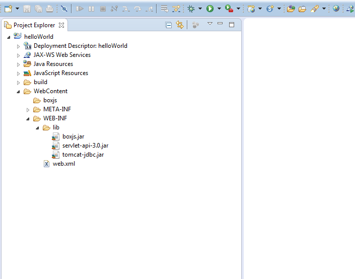
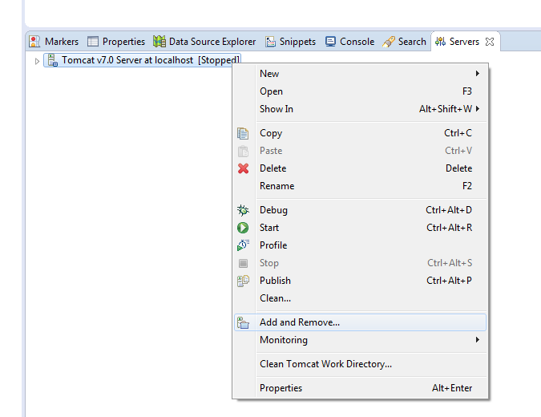
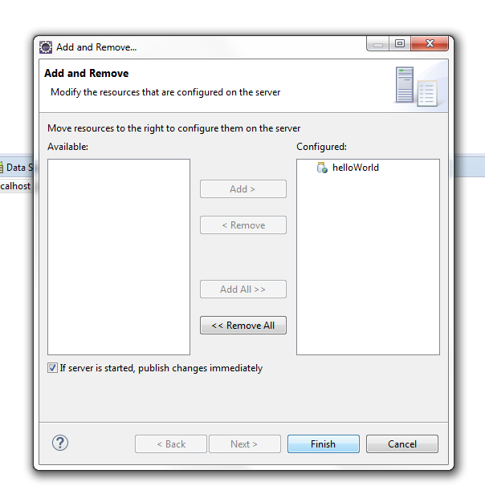
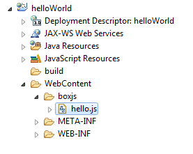

# Configurando o ambiente de desenvolvimento

Para começarmos a trabalhar com o boxJS precisamos, antes de mais nada, fazer algumas configurações no nosso ambiente de 
desenvolvimento. Esse tutorial é feito utilizando o Eclipse e o Tomcat, mas qualquer IDE e qualquer servidor de aplicação
pode ser usado, a configuração será semelhante, mas não exatamente a mesma.

Começamos criando um Dynamic Web Project:

Neste passo é importante checar se o Tomcat esta selecionado e clicar para ir para o próximo, ao invés de finalizar, conforme 
imagem abaixo:

Nesta tela não há necessidade de modificar nada, apenas siga para a próxima.

Nesta parte é importante marcar a opção de gerar o web.xml automaticamente, conforme imagem abaixo:

Pronto, temos nosso primeiro projeto criado, porém o boxJS ainda não funcionará, precisamos fazer apenas mais uma configuração.

Adicionaremos à pasta `lib`, que está dentro da pasta `WEB-INF`, que, por sua vez, está dentro da pasta `WebContent`, o [jar do boxJS](https://github.com/cneryjr/boxjs/blob/master/lib/boxjs.jar?raw=true),
do [Tomcat](https://github.com/cneryjr/boxjs/blob/master/lib/tomcat-jdbc.jar?raw=true) e da [api de servlet](https://github.com/cneryjr/boxjs/blob/master/lib/servlet-api-3.0.jar?raw=true), conforme imagem abaixo:

Feito isso, basta que adicionemos nosso novo projeto ao Tomcat, conforme as imagens abaixo:

É importante lembrar que todos os arquivos `.js` devem estar dentro da pasta boxjs ou algum subdiretório, conforme a 
imagem abaixo.

Pronto, nosso ambiente já está completamente pronto para funcionar o boxJS!